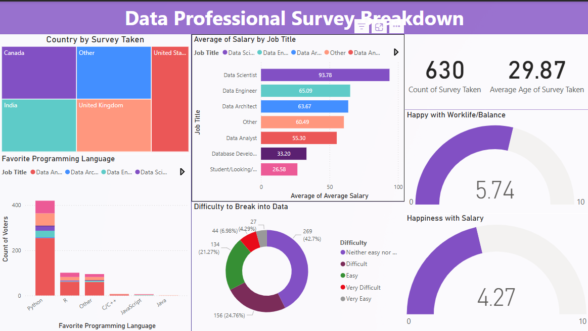

# Data Professional Survey Breakdown

This **Power BI dashboard** visualizes insights from a survey of **630 data professionals** around the world. It provides a comprehensive breakdown of *job roles, salary expectations, work-life balance, and the difficulty of entering the data field*. The visualizations are interactive and designed to help users explore key metrics and patterns in the data industry.

## 📁 Files Included
- `Data Professional Survey Breakdown.pbix` - Main Power BI report file
- `data.xlsx` - Data used for report file
- `Screenshots/` - Preview images of the report

## 📊 Features

- Visual representation of survey participants across countries including the US, UK, India, and Canada
- Horizontal bar chart comparing average salaries for roles like Data Scientist, Data Engineer, Analyst, and more.
- Donut chart showing the perceived difficulty level of entering the data profession.
- Bar chart breakdown of most preferred programming languages among professionals.

## 📷 Screenshot

## 🔧 Tools Used
- Power BI Desktop
- Microsoft Excel (for data cleaning)

## How to Use
- Open *Data Professional Survey Breakdown.pbix* in Power BI Desktop.
- Connect or replace with your own job dataset
- Refresh visuals to update insights.
